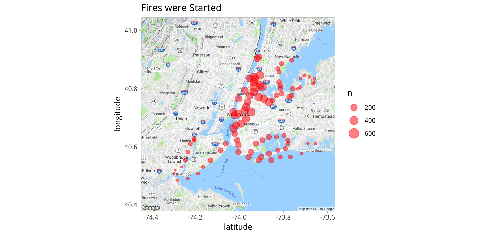
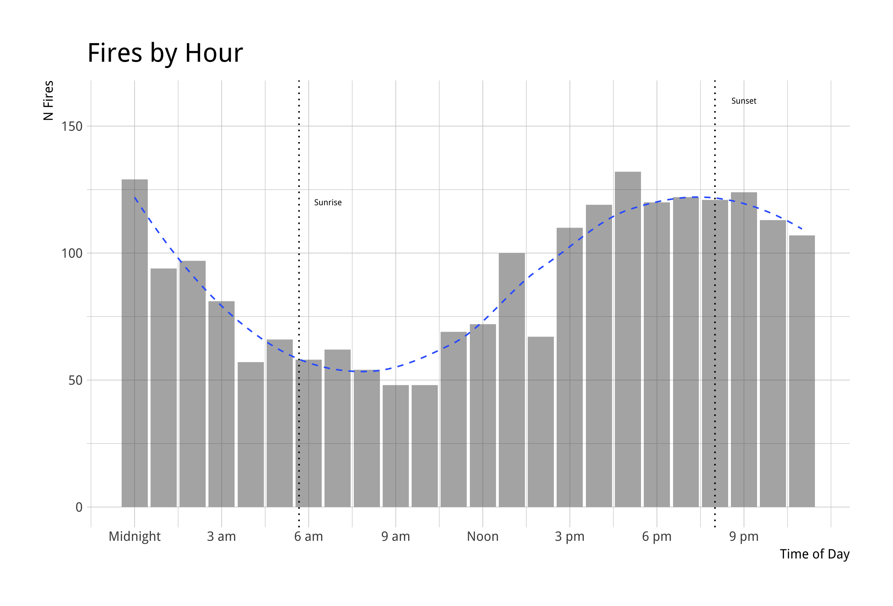

```{r setup, include=FALSE, warning=FALSE}
library(knitr)
library(kableExtra)
opts_chunk$set(echo = TRUE, eval = TRUE, collapse = TRUE, cache = TRUE, message = FALSE)
options(htmltools.dir.version = FALSE)
options(knitr.table.format = "html")

fire_sums <-
  read_csv(here("data", "derived", "fire_sums.csv"))
```


class: inverse

## Quick About Me

<br>

.left-column[

**Day job**: Data Scientist at [Earlybird Software](http://www.earlybird.co/), former co-organizer of [R-Ladies Chicago](https://rladieschicago.org/)

**For fun**: ultimate frisbee player
<!-- .pull-left[] -->

**GitHub**: [@aedobbyn](https://github.com/aedobbyn)

**Website**: https://dobb.ae

**Twitter**: [@dobbleobble](https://twitter.com/dobbleobble)

]

.right-column[]

---

## This Talk


- Was originally a [talk](https://aedobbyn.github.io/nyc-fires/index.html) about the [`drake`](https://github.com/ropensci/drake) package

--


--

<br>

- `drake` is a workflow management package for data pipelines (come talk to me about it!)

--

<br>

#### The Pipeline

- Will use Twitter and Google Maps geocoding APIs to figure out when and where fires happen in NYC

--

<br>

**Caveats**

This analysis relies on the [rtweet](https://github.com/mkearney/rtweet) and [ggmap](https://github.com/dkahle/ggmap) packages.

To be able to run it in full you'll need a [Twitter API access token](https://rtweet.info/articles/auth.html) and [Google Maps Geocoding API key](https://developers.google.com/maps/documentation/geocoding/intro#Geocoding).

--

<br>
<br>
<br>

All code, slides, and data on [GitHub](https://github.com/aedobbyn/nyr-2019). Use for whatever you like!


---

class: blue-light 

<!-- background-image: url("https://static01.nyt.com/images/2018/12/29/nyregion/28xp-explosion-sub-print/28xp-explosion-sub-facebookJumbo.jpg) -->

## Why Fires?

Remember the [crazy blue light](https://twitter.com/NYCFireWire/status/1078478369036165121) in NYC from late December?

--

<p align="left" style="padding-right: 20%;">

</p>

--

`r emo::ji("scream")` `r emo::ji("scream")` `r emo::ji("scream")`


---

.pull-right[]

<br>

The Twitter account that let us know that this wasn't in fact aliens is [NYCFireWire](https://twitter.com/NYCFireWire).

<br>

Normally they just tweet out fires and their locations in a more or less predictable pattern:

<br>


--
Before February:

`<borough> ** <some numbers> ** <address> <description of fire>`

After February:

`<borough> *<type of fire>* Box <digits> <address> <description of fire>`

<br>


We can use their tweets to get some info on where and when fires happen in NYC.


???

I'll illustrate a way you might want to use `drake` with something that's close to home for us.

What if we were constructing an analysis of these tweets and wanted to make sure our pipeline worked end-to-end, but didn't want to unnecessarily re-run outdated parts of it unless we needed to?


---

## The Pipeline

1. Pull in tweets, either a big initial batch or any new ones that show up

--

2. Extract addresses from the tweets (`r emo::ji("notes")` regex time `r emo::ji("notes")`)

--

3. Send addresses to the Google Maps API to grab their latitudes and longitudes

--

4. Profit

--

<br>

All functions are defined in [`didnt_start_it.R`](https://github.com/aedobbyn/nyr-2019/blob/master/R/didnt_start_it.R), which we'll source in now.

```{r, warning=FALSE, message=FALSE}
source(here::here("R", "didnt_start_it.R")) 
```


---

### Sneak Peek

(Sans `drake`)

```{r eval=FALSE}
# Get tweets
lots_o_fires <-
  get_tweets(
    n_tweets_seed = 3000,
    output_path = here("data", "raw", "lots_o_fires.csv"),
    write_out = TRUE
  )

# Pull out addresses
addresses <-
  pull_addresses(lots_o_fires)

# Geocode
lat_long <-
  get_lat_long(addresses)

# Sum up n fires by lat-long combo
fire_sums <-
  count_fires(lat_long)
```


---

## Getting Tweets

The main function we'll use is `rtweet::get_timeline`.

--

Which returns a looooot of stuff.

```{r}
get_timeline("NYCFireWire")
```

---

## Getting Tweets

The main function we'll use is `rtweet::get_timeline`.

Which returns a looooot of stuff.

<br>


---

## Getting Tweets

Wowza.

--

<br>

We'll wrap that up in a function that: 

<br>

--

- Pulls in tweets, either the first big batch or any new ones that show up

--

<br>

- Writes the result out to a file 


---

## Grabbing Tweets

<br>

**First Big Batch**

- `get_seed_tweets` grabs a batch of tweets *or* reads in seed tweets from a file if the file exists

--

<br>

**New Ones**

- `get_more_tweets` checks if there are new tweets and, if so, pulls in the right number of them

--

<br>

**Wrapper**

- `get_tweets` 
  - If *not* passed a dataframe: runs `get_seed_tweets` 
  - If passed a dataframe: runs `get_more_tweets`
  

???

- If neither file nor `tbl` is supplied as arguments, grabs an initial *seed* batch of tweets
- If either is supplied, checks for new tweets and grabs them if any
- Spits out the latest to the same file

---

A simplified version of `get_seed_tweets`:

If an `input_path` exists, read in from there instead of grabbing tweets.
If an `output_path` exists, write out what we've got to that path.

```{r eval=FALSE}
get_seed_tweets <- function(user = firewire_handle, 
                            n_tweets = 50, max_id = NULL, 
                            input_path = NULL, output_path = NULL, 
                            write_out = FALSE) {
  if (!is.null(input_path) && file_exists(input_path)) {
    out <-
      read_csv(input_path)
  } else {
    out <-
      get_timeline(user = user, n = n_tweets, max_id = max_id) %>%
      select(text, status_id, created_at, screen_name) 
  }

  if (!is.null(output_path) && write_out == TRUE) {
    write_csv(out, output_path)
  }
  out
}
```


---


```{r}
old_tweet_id <- "1084948074588487680" # From Jan 14
```

`status_id` is useful because we can supply a `max_id` to get only tweets older than that ID `r emo::ji("thumbsup")`

<br>

--

```{r}
get_seed_tweets(n_tweets = 5,
             max_id = old_tweet_id) %>% #<<
  select(status_id, created_at)
```


---

## Reupping Tweets

Check if there are new tweets at an account:

```{r eval=FALSE}
there_are_new_tweets <- function(tbl,
                                 user = firewire_handle,
                                 verbose = TRUE) {
  latest_dt <-
    tbl %>%
    arrange(desc(created_at)) %>%
    slice(1) %>%
    pull(created_at)

  if (verbose) message("Searching for new tweets.")

  new <- get_seed_tweets(user = user, n_tweets = 1)

  if (max(new$created_at) <= latest_dt) {
    if (verbose) message("No new tweets to pull.")
    FALSE
  } else {
    TRUE
  }
}
```

---

Reup if `there_are_new_tweets()` is true.

```{r eval=FALSE}
get_more_tweets <- function(tbl,
                            user = firewire_handle,
                            n_tweets = 20,
                            output_path = NULL,
                            write_out = TRUE,
                            verbose = TRUE) {
  if (!there_are_new_tweets(tbl = tbl, user = user)) {
    return(NULL)
  }

  new <- get_seed_tweets(user = user, n_tweets = n_tweets)

  out <-
    new %>%
    filter(created_at > max(tbl$created_at))

  if (verbose) message(glue("{nrow(out)} new tweet(s) pulled."))
  
  if (!is.null(output_path) && write_out == TRUE) {
    write_csv(out, output_path, append = TRUE)
  }

  out
}
```


---

All together:

```{r eval=FALSE}
get_tweets <- function(tbl = NULL,
                       user = firewire_handle,
                       max_id = NULL,
                       n_tweets_seed = 10,
                       n_tweets_reup = 5,
                       input_path = NULL,
                       output_path = NULL,
                       write_out = TRUE,
                       verbose = TRUE, ...) {
  if (is.null(tbl)) {
    out <- get_seed_tweets(n_tweets = n_tweets_seed, ...)
  } else {
    new <-
      get_more_tweets(n_tweets = n_tweets_reup, ...)

    out <-
      tbl %>%
      bind_rows(new) %>%
      arrange(desc(created_at))
  }

  out
}
```


---

#### Let's get some tweets

--

<br>

```{r}
get_tweets(n_tweets_seed = 15)
```


---

## Reupping Tweets

To show how `get_tweets` can start with a `tbl` of tweets and look for new ones,

we'll grab 10 `seed_tweets` that are all **older** than an old tweet ID.

--

<br>

```{r}
seed_tweets <- 
  get_tweets(
    n_tweets_seed = 10,
    max_id = old_tweet_id # Old tweet!
  )

nrow(seed_tweets)
```

---

## Reupping Tweets

Using `seed_tweets` as an input to the same `get_tweets` function,

we check for new tweets, and, if there are any, pull them in.

--

```{r}
full_tweets <- 
  get_tweets(seed_tweets, 
             n_tweets_reup = 5) #<<
```

--

<br>

```{r}
nrow(seed_tweets)
```

--

<br>

```{r}
nrow(full_tweets)
```


---

A closer look at just the text of the tweets:

```{r}
full_tweets %>% 
  select(text) %>% 
  kable()
```


---

## Getting Addresses

With `pull_addresses` we parse the text of the tweet to pull out borough and street and string them together into an address.

```{r}
pull_addresses <- function(tbl) {
  tbl %>%
    mutate(
      text = str_replace_all(text, "&amp;", "&"),
      borough = str_extract(text, "^[^\\s]*\\s") %>%
        str_remove("\\s"),
      street =
        case_when(
          str_detect(text, "Box") ~ pull_box_address(text),
          TRUE ~ pull_non_box_address(text)
        )
    ) %>%
    rowwise() %>%
    mutate(
      borough =
        case_when(
          str_detect(borough, borough_reg) ~ borough %>% 
            clean_borough(),
          TRUE ~ NA_character_
        ),
      address =
        glue::glue("{street}, {borough}", .na = "") %>%
          str_remove("[, ]?") %>%
          str_trim()
    ) %>%
    mutate(
      address = na_if(address, "")
    ) %>%
    select(borough, street, address, text, created_at)
}
```


---

## Getting Addresses

```{r}
get_tweets(max_id = old_tweet_id) %>% 
  pull_addresses() %>%   #<<
  select(text, street, borough, address) %>% 
  kable() 
```

---

## Getting Lat and Long

Last step of the main pipeline! 

--

**Reverse geocoding** = getting latitude and longitude from an address.

The [`ggmap`](https://www.rdocumentation.org/packages/ggmap/versions/2.6.1/topics/geocode) package exposes this feature of the [Google Maps](https://cloud.google.com/maps-platform/) API.

<br>

--

The `ggmap::geocode` accepts a string and returns a dataframe of `lon` and `lat`.

--

```{r message=FALSE}
(sherlock <- 
   ggmap::geocode("221B Baker Street, London"))
```

---

#### Where's Sherlock?

--

```{r message=FALSE}
get_map("london", zoom = 13) %>% 
  ggmap() +
  geom_point(data = sherlock, 
             aes(x = lon, y = lat), 
             color = "blue", size = 10)
```


## `r emo::ji("wave")`

---


#### Where's Sherlock?

<br>

<p>
  
</p>

--

<br>

## `r emo::ji("wave")`

---

So we can put that together into a function that works on a dataframe.


```{r}
get_lat_long <- function(tbl) {
  tbl %>%
    mutate(
      address =
        case_when(
          is.na(address) ~ "", # Gives an NA in lat and long response df
          TRUE ~ address
        ),
      l_l = address %>%
        geocode() %>% # <-- doing the work here #<<
        list()
    ) %>%
    unnest() %>%
    select(address, lat, lon, created_at, text) %>%
    rename(long = lon)
}
```

---

#### Let's get some geo info

<br>

--

```{r}
full_tweets %>% 
  sample_n(1) %>% 
  pull_addresses() %>% 
  get_lat_long() %>%  #<<
  select(text, address, lat, long) %>% 
  kable()
```

--

<br>

## `r rep(emo::ji("thumbsup"), 3) %>% str_c(collapse = ' ')`

---

## Counting Up

`count_fires` sums up the total number of fires per `lat`-`long` combo

<br>

```{r}
count_fires <- function(tbl) {
  tbl %>%
    drop_na() %>%
    count(lat, long)
}
```

<br>

so we can plot them on a map (thanks again, `ggmap`)

---

## Mapping

```{r}
get_map("new york city") %>% 
  ggmap()
```


---

```{r plot_fire_sums, eval=FALSE}
plot_fire_sums <- function(tbl, city = nyc_map,
                           output_path = 
                             here("plots", "fire_sums_plot.png"),
                           ...) {
  tbl <-
    tbl %>%
    drop_na(lat, long)

  fire_layer <-
    geom_point(
      data = tbl, aes(long, lat, size = n),
      color = "red", alpha = 0.5
    )

  plt <- ggmap(city) +
    fire_layer +
    ggtitle("Fires were Started") +
    labs(x = "Longitude", y = "Latitude",
         size = "Number of Fires") +
    theme_light()

  if (!is.null(output_path)) {
    ggsave(output_path,
      device = "png"
    )
  } else {
    plt
  }
}
```


---

Using about a year's worth of tweets (~3k or so):

```{r, message=FALSE, warning=FALSE}
plot_fire_sums(fire_sums, output_path = NULL)
```


<!-- <p> -->
<!--  -->
<!-- </p> -->
 
---


--

<br>

...time for...

<br>

--

#### `r emo::ji("high_voltage")` Fire trivia lighting round! `r emo::ji("high_voltage")`

---

<br>

#### `r emo::ji("high_voltage")` Fire trivia lighting round! `r emo::ji("high_voltage")`

--

<br>

*On what days of the week are fires most common?*

--

<br>

Answer: 

**Monday through Wednesday**

```{r}

```


---

<br>

#### `r emo::ji("high_voltage")` Fire trivia lighting round! `r emo::ji("high_voltage")`

--

<br>

*Which borough has the most fires?*

--

<br>

Answer:

**Brooklyn**

---

<br>

#### `r emo::ji("high_voltage")` Fire trivia lighting round! `r emo::ji("high_voltage")`

<br>

*Which borough has the most fires per capita?*

--

<br>

Answer:

**Staten Island**


---

#### `r emo::ji("high_voltage")` Fire trivia lighting round! `r emo::ji("high_voltage")`

<br>

*What time of day do fires typically happen?*

--

Answer:

--


<!-- .pull-left[] -->


<!-- style="padding-right:100px;" -->

---

class: inverse

<br>

## Thanks!


