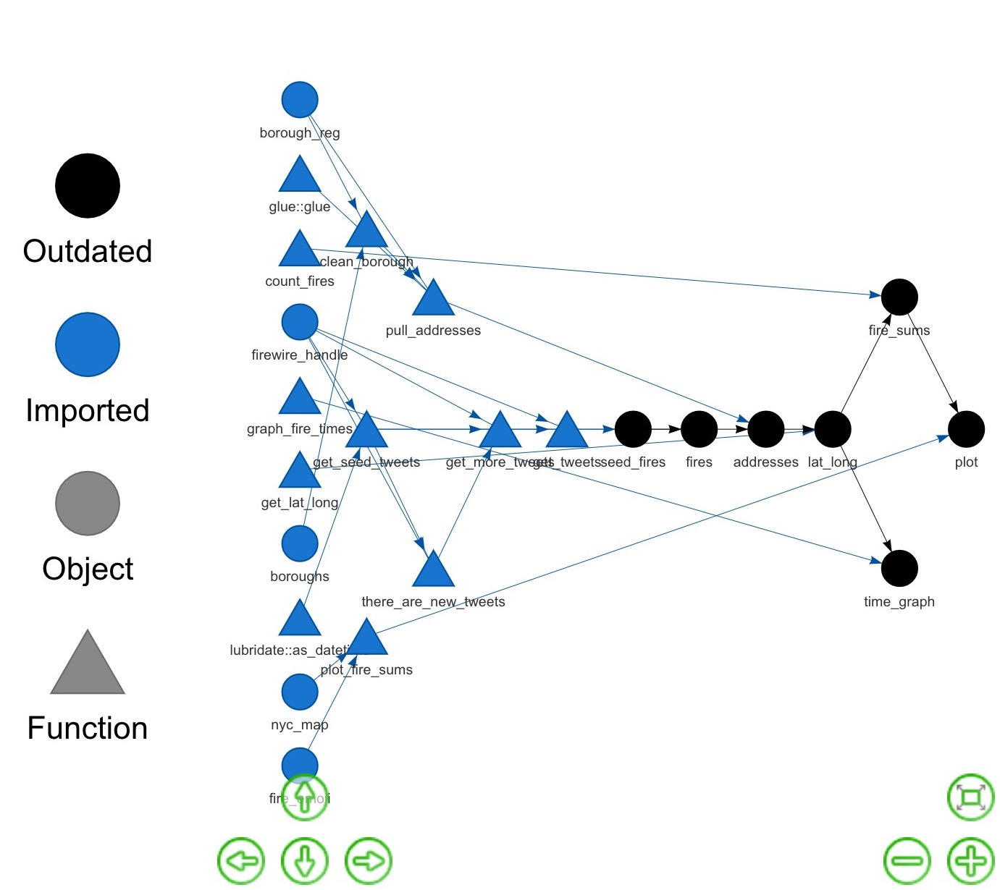
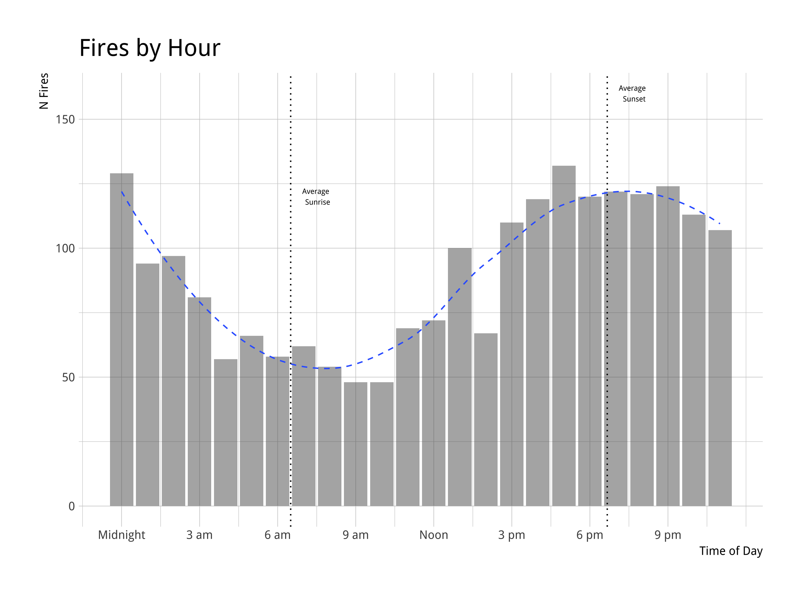

```{r setup, include=FALSE, warning=FALSE}
library(knitr)
library(kableExtra)
opts_chunk$set(echo = TRUE, eval = TRUE, collapse = TRUE, cache = TRUE, message = FALSE)
options(htmltools.dir.version = FALSE)
options(knitr.table.format = "html")

fire_sums <-
  read_csv(here("data", "derived", "fire_sums.csv"))
```


class: inverse

## Quick About Me

<br>

.left-column[

**Day job**: ultimate frisbee player

**For fun**: Data Scientist at [Earlybird Software](http://www.earlybird.co/), former co-organizer of [R-Ladies Chicago](https://rladieschicago.org/)

**GitHub**: [@aedobbyn](https://github.com/aedobbyn)

**Website**: https://dobb.ae

**Twitter**: [@dobbleobble](https://twitter.com/dobbleobble)

]

.right-column[]

---

## This Talk


- We will use Twitter and Google Maps APIs to figure out when and where fires happen in NYC

--

<br>

- Great use case for the `drake` package!

--


--

<br>
<br>
<br>
<br>

**Caveats**

This analysis relies on the [rtweet](https://github.com/mkearney/rtweet) and [ggmap](https://github.com/dkahle/ggmap) packages.

To be able to run it in full you'll need a [Twitter API access token](https://rtweet.info/articles/auth.html) and [Google Maps Geocoding API key](https://developers.google.com/maps/documentation/geocoding/intro#Geocoding).

--

<br>
<br>

All code, slides, and data on [GitHub](https://github.com/aedobbyn/nyr-2019). Use for whatever you like!

---

class: blue-light 

<!-- background-image: url("https://static01.nyt.com/images/2018/12/29/nyregion/28xp-explosion-sub-print/28xp-explosion-sub-facebookJumbo.jpg) -->

## Why Fires?

Remember the [crazy blue light](https://twitter.com/NYCFireWire/status/1078478369036165121) in NYC from late December?

--

<p align="left" style="padding-right: 20%;">

</p>

--

<br>

## `r emo::ji("scream")` `r emo::ji("scream")` `r emo::ji("scream")`


---

.pull-right[]

<br>

The Twitter account that let us know that this wasn't in fact aliens is [NYCFireWire](https://twitter.com/NYCFireWire).

--

<br>

Normally they just tweet out fires and their locations in a more or less predictable pattern:

<br>


--
Before February:

`<borough> ** <some numbers> ** <address> <description of fire>`

After February:

`<borough> *<type of fire>* Box <digits> <address> <description of fire>`

<br>


We can use their tweets to get some info on where and when fires happen in NYC.


???

I'll illustrate a way you might want to use `drake` with something that's close to home for us.

What if we were constructing an analysis of these tweets and wanted to make sure our pipeline worked end-to-end, but didn't want to unnecessarily re-run outdated parts of it unless we needed to?


---

## The Pipeline

1. Pull in tweets, either a big initial batch or any new ones that show up

--

2. Extract addresses from the tweets (`r emo::ji("notes")` regex time `r emo::ji("notes")`)

--

3. Send addresses to the Google Maps API to grab their latitudes and longitudes

--

4. Profit

--

<br>

All functions are defined in [`R/didnt_start_it.R`](https://github.com/aedobbyn/nyr-2019/blob/master/R/didnt_start_it.R) in this repo, which we'll source in now.

```{r, warning=FALSE, message=FALSE}
source(here::here("R", "didnt_start_it.R")) 
```


---

### Sans `drake`


```{r eval=FALSE}
# Get tweets
lots_o_fires <-
  get_tweets(
    n_tweets_seed = 3000,
    output_path = here("data", "raw", "lots_o_fires.csv"),
    write_out = TRUE
  )

# Pull out addresses
addresses <-
  pull_addresses(lots_o_fires)

# Geocode
lat_long <-
  get_lat_long(addresses)

# Sum up n fires by lat-long combo
fire_sums <-
  count_fires(lat_long)

# Plot fires on a map
plot_fire_sums(fire_sums)
```


---

## `drake`'s Main Idea

--

[`drake`](https://github.com/ropensci/drake) is workflow manager for your R code.

--

In a complex analysis pipeline, it makes changing your code easier.

--

<br>

`drake` loves changes.

--

<p align="left">

</p>

---

## `drake`'s Main Idea

--

When something changes that makes the most recent results **out-of-date**, `drake` rebuilds *only* things that need to be rebuilt, so that

--

*what gets done stays done*.

<p align="left" style="padding-right: 20%;">

</p>

--

Created and maintained by [Will](https://twitter.com/wmlandau) [Landau](https://github.com/wlandau) and friends.

---

class: inverse

## Better Workflows

<br>

Does your analysis directory look like this?

--

.pull-left[


`01_import.R`

`02_clean.R`

`03_deep_clean.R`

`04_join.R`

`05_analyze.R`

`06_analyze_more.R`

`07_report.Rmd`
]

--

.pull-right[

<br>

#### What's bad about this?

<br>


**It doesn't scale well**

<br>

Which you know if you've tried to add another intermediate step or reorganize your subdirectories.

]

---

#### Your pipeline depends on

--

- You keeping file names up-to-date and sourcing things in the right order

--

- You knowing when the input data changes 

--

- You knowing which objects and functions are used by which other objects and functions

<!-- - Explicitly saving intermediate data representations -->

--

<br>

#### If something breaks

--

- Can you be sure about where it broke?

--

- Do you know which intermediate data stores are up to date?

--

- Do you need to re-run the entire pipeline again? 

--

.pull-right[

<p align="right">

</p>

]


---

## Nice features of `drake`


.pull-left[

1) Tidy **dataframe** shows how pieces in your pipeline fit together

]

--

<br>

.pull-right[

2) **Dependency graph** of all inputs and outputs

]

<br>

--

.pull-left[

3) Great for iteration and **reproducibility**, especially if used with git

]

<br>

--

.pull-right[

4) Automated parallel and distributed computing

]

<br>

--

.pull-left[

5) It's all in R, so no writing config files! `r emo::ji("tada")`

]

<!-- .pull-right[]  -->

<!-- .pull-right[] -->


---

## Dependency Graph


---

class: inverse

## A Few Pieces of `drake` Vocab

<br>

> **Targets** are the objects that drake generates;

<br>

--

> **Commands** are the pieces of R code that produce them.

<br>

--

> **Plans** wrap up the relationship between targets and commands into a workflow representation: a dataframe.

<br>

???

one column for targets, and one column for their corresponding commands.

---

## More on Plans

Plans are like that top-level script that runs your entire pipeline.

<br>

```{r, eval=FALSE}
source("01_import.R")
source("02_clean.R")
...
source("06_analyze_more.R")

final <- do_more_things(object_in_env)

write_out_my_results(final)
```

<br>

*But*, a plan **knows about the dependencies** in your code.


---

## How to `drake`

--

<br>

1) Store functions and any packages you need to load in a file 

`funs.R`


--

2) Store a `drake` **plan** in another file

```{r}
plan <- 
  drake_plan(
    cleaned_data = clean_my(raw_data),
    results = analyze_my(cleaned_data),
    report = report_out_my(results)
  )
```


--

3) **Run** the plan


```{r, eval=FALSE}
make(plan)
```

---

## What `drake` does

--

```{r, eval=TRUE}
plan <- 
  drake_plan(
    cleaned_data = clean_my(raw_data),
    results = analyze_my(cleaned_data),
    report = report_out_my(results)
  )
```

--

`drake_plan` stores your plan as targets and commands in a dataframe.

--

```{r, eval=TRUE}
plan
```


---

## What `drake` does


```{r}
plan
```

--

```{r, eval=FALSE}
make(plan)
```

--

**First run** of `make(plan)`:

`drake` runs the plan from scratch

--

<br>

**Thereafter**:

`drake` will only rebuild targets that are out of date, and everything downstream of them


---

## What makes a target become out of date?

1) A trigger is activated 


--

2) Something used to generate that target *or one of its upstream targets* has changed

--

```{r}
plan <-
  drake_plan(
    cleaned_data = clean_my(raw_data),
    results = analyze_my(cleaned_data), #<<
    report = report_out_my(results)
  )
```


`drake` knows that `results` depends on the object `cleaned_data` and the function `analyze_my()`

because those are both part of the command used to generate `results`.

<br>

--

**So, if `cleaned_data` changes or `analyze_my` changes, `results` is out of date.**


---

## Where is all this stuff stored?

<br>

#### **targets**

--

In a hidden `.drake` directory, or cache, in your project's root. [More on storage.](https://ropensci.github.io/drake/articles/storage.html)

--

<p align="left">
  
  <figcaption style="margin-left: 20%;">Spot the cache among the hidden dirs.</figcaption>
</p>

--

<br>

`loadd()` loads targets from the cache into your R session.

--

`clean()` cleans the cache. (You can recover a cache if you clean it by accident.)

<br>

---

### Without `drake`

```{r eval=FALSE}
# Get tweets
fires <-
  get_tweets(
    n_tweets_seed = 3000,
    output_path = here("data", "raw", "lots_o_fires.csv"),
    write_out = TRUE
  )

# Pull out addresses
addresses <-
  pull_addresses(fires)

# Geocode
lat_long <-
  get_lat_long(addresses)

# Sum up n fires by lat-long combo
fire_sums <-
  count_fires(lat_long)

# Plot fire sums on a map of NYC
plot_fire_sums(fire_sums)
```


---

## With `drake`

<br>

```{r}
plan <-
  drake_plan(
    seed_fires = get_tweets(), 
    fires = target(
      command = get_tweets(tbl = seed_fires),
      trigger = trigger(condition = there_are_new_tweets) 
    ),
      # Extract addresses from tweets
    addresses = pull_addresses(fires), 
      # Send to Google for lat-longs
    lat_long = get_lat_long(addresses), 
      # Sum up n fires per lat-long combo
    fire_sums = count_fires(lat_long), 

    plot = plot_fire_sums(fire_sums)
  )
```

---



---

<br>

```{r}
plan
```


--

<br>

#### Yay, let's get some `r emo::ji("fire")`s!

---

## Getting Tweets

The main function we'll use is `rtweet::get_timeline`.

--

Which returns a looooot of stuff.

```{r}
get_timeline("NYCFireWire")
```

---

## Getting Tweets

The main function we'll use is `rtweet::get_timeline`.

Which returns a looooot of stuff.

<br>


---

## Getting Tweets

Wowza.

--

<br>

We'll wrap that up in a function that: 

<br>

--

- Pulls in tweets, either the first big batch or any new ones that show up

--

<br>

- Writes the result out to a file 


---

## Grabbing Tweets

<br>

**First Big Batch**

- `get_seed_tweets` grabs a batch of tweets *or* reads in seed tweets from a file if the file exists

--

<br>

**New Ones**

- `get_more_tweets` checks if there are new tweets and, if so, pulls in the right number of them

--


???

- If neither file nor `tbl` is supplied as arguments, grabs an initial *seed* batch of tweets
- If either is supplied, checks for new tweets and grabs them if any
- Spits out the latest to the same file

---

<br>

#### Let's get some tweets

--


```{r}
get_tweets(n_tweets_seed = 15)
```


---

A closer look at just the text of the tweets:

--

```{r, echo=FALSE}
full_tweets %>% 
  select(text) %>% 
  kable(col.names = NULL)
```


---

## Extracting Addresses

Next step is to pull out addresses.

<br>

These come in two parts: **borough** and **street**.

<br>

```{r, echo=FALSE}
full_tweets %>% 
  slice(1:5) %>% 
  select(text) %>% 
  kable(col.names = NULL)
```

---

~ After some fun w/ regexes ~

--

```{r}
pull_box_address <- function(x) {
  x %>%
    str_extract("Box [0-9]+.+[,\\.]") %>%
    str_extract("\\..+?\\.") %>%
    str_remove_all("[,\\.]") %>%
    str_trim()
}
```

--

for a given tweet

```{r echo=FALSE}
a_box_address <- 
  full_tweets %>% 
  filter(str_detect(text, "Box [0-9]+[,\\.]")) %>% 
  slice(1) %>% 
  select(text)
```

```{r, echo=FALSE}
a_box_address %>% 
  kable(col.names = NULL)
```

--

<br>

we can pull just the street address out.

--

```{r}
a_box_address %>% 
  pull_box_address() %>% 
  kable(col.names = NULL)
```


---

## Getting Addresses

```{r}
get_tweets(max_id = old_tweet_id) %>% 
  pull_addresses() %>%   #<<
  select(text, street, borough, address) %>% 
  kable() 
```

---

## Getting Lat and Long

Last step of the main pipeline! 

--

**Reverse geocoding** = getting latitude and longitude from an address.

The [`ggmap`](https://www.rdocumentation.org/packages/ggmap/versions/2.6.1/topics/geocode) package exposes this feature of the [Google Maps](https://cloud.google.com/maps-platform/) API.

<br>

--

The `ggmap::geocode` accepts a string and returns a dataframe of `lon` and `lat`.

--

```{r message=FALSE}
(sherlock <- 
   ggmap::geocode("221B Baker Street, London"))
```

---

#### Where's Sherlock?

```{r}
london <- get_map("london", zoom = 13) 

ggmap(london)
```

---

#### Where's Sherlock?

--

```{r message=FALSE}
ggmap(london) +
  geom_point(data = sherlock, 
             aes(x = lon, y = lat), 
             color = "blue", size = 10)
```


## `r emo::ji("wave")`

---


#### Where's Sherlock?

<br><br>

<p>
  
</p>

--

<br>

<div align="middle">
  <h2> `r emo::ji("wave")` </h2>
</div>

---

<br>

Now we can stick geocoding into our pipeline.

<br>


```{r}
get_lat_long <- function(tbl) {
  tbl %>%
    mutate(
      address =
        case_when(
          is.na(address) ~ "", # Gives an NA in lat and long response df
          TRUE ~ address
        ),
      l_l = address %>%
        geocode() %>% # <-- doing the work here #<<
        list()
    ) %>%
    unnest() %>%
    select(address, lat, lon, created_at, text) %>%
    rename(long = lon)
}
```

---

#### Let's get some geo info

<br>

--

```{r}
full_tweets %>% 
  sample_n(1) %>%    # Random tweet
  pull_addresses() %>% 
  get_lat_long() %>%  #<<
  select(text, address, lat, long) %>% 
  kable()
```

--

<br>

## `r rep(emo::ji("thumbsup"), 3) %>% str_c(collapse = ' ')`

---

## Counting Up

`count_fires` sums up the total number of fires per `lat`-`long` combo

<br>

```{r}
count_fires <- function(tbl) {
  tbl %>%
    drop_na() %>%
    count(lat, long)
}
```

<br>

--

so we can plot them on a map (thanks again, `ggmap`)

---

Using about a year's worth of tweets (~3k or so):

```{r, message=FALSE, warning=FALSE}
plot_fire_sums(fire_sums, output_path = NULL)
```


<!-- <p> -->
<!--  -->
<!-- </p> -->
 
---


--

<br>

...time for...

<br>

--

#### `r emo::ji("high_voltage")` Fire trivia lighting round! `r emo::ji("high_voltage")`

(Code for these in [analysis.R](https://github.com/aedobbyn/nyr-2019/blob/master/R/analysis.R))

```{r echo=FALSE}
fires_by_borough <- 
  read_csv(here("data", "derived", "fires_by_borough.csv"))
fires_by_borough_per_cap <- 
  read_csv(here("data", "derived", "fires_by_borough_per_cap.csv"))
by_day <-
  read_csv(here("data", "derived", "fires_by_day.csv"))
```


---

#### `r emo::ji("high_voltage")` Fire trivia lighting round! `r emo::ji("high_voltage")`

--

<br>

*On what day of the week are fires most common?*

--

<br>

Answer: 

**Wednesday**

```{r echo=FALSE}
by_day %>% 
  rename(
    `Day of Week` = wday,
    `N` = n
  ) %>% 
  kable()
```


---

#### `r emo::ji("high_voltage")` Fire trivia lighting round! `r emo::ji("high_voltage")`

--

<br>

*Which borough has the most fires?*

--

<br>

Answer:

**Brooklyn**

```{r echo=FALSE}
fires_by_borough %>% 
  dobtools::cap_df() %>% 
  kable()
```


---


#### `r emo::ji("high_voltage")` Fire trivia lighting round! `r emo::ji("high_voltage")`

<br>

*Which borough has the most fires per capita?*

--

<br>

Answer:

**Staten Island**

```{r echo=FALSE}
fires_by_borough_per_cap %>% 
  mutate(
    population = population %>% format(big.mark = ",")
  ) %>% 
  select(borough, n, population, fires_per_person) %>% 
  dobtools::cap_df() %>% 
  kable(align = "r")
```

<br>
<br>

(Population stats scraped from [citypopulation.com](https://www.citypopulation.de/php/usa-newyorkcity.php))

---


#### `r emo::ji("high_voltage")` Fire trivia lighting round! `r emo::ji("high_voltage")`


*What time of day do fires typically happen?*

--

Answer:

--


<!-- .pull-left[] -->


<!-- style="padding-right:100px;" -->

(Daily sunrise and sunset times scraped from [timeanddate.com](https://www.timeanddate.com/sun/usa/new-york).)

---

class: inverse

<br>

## Thanks!


